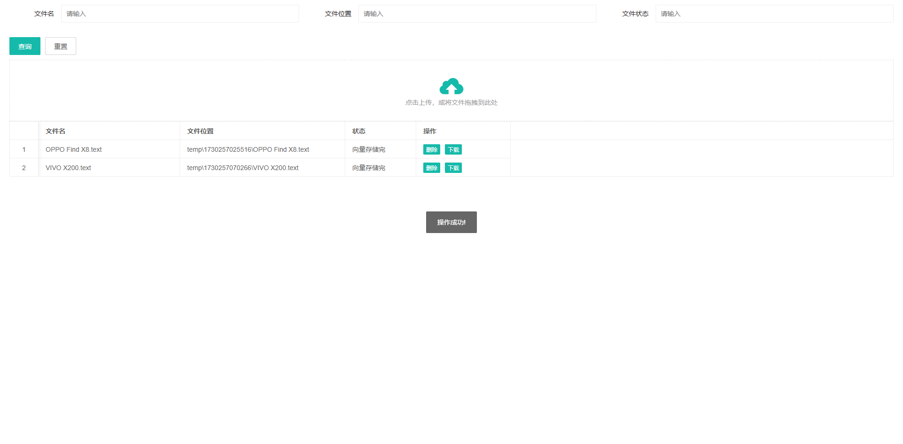

# easy-ai-spring-boot-starter
# 易智Spring

[](https://jitpack.io/#com.gitee.wb04307201/easy-ai-spring-boot-starter)
[](https://gitee.com/wb04307201/easy-ai-spring-boot-starter)
[](https://gitee.com/wb04307201/easy-ai-spring-boot-starter)
[](https://github.com/wb04307201/easy-ai-spring-boot-starter)
[](https://github.com/wb04307201/easy-ai-spring-boot-starter)  
  

> 这不是一个AI大模型，但是可以帮你快速集成AI大模型到Spring项目中，  
> 并通过“检索增强生成(RAG)”的方式建立专家知识库帮助大模型回答问题。  
> 
> 核心功能依赖于[Spring AI](https://docs.spring.io/spring-ai/reference/index.html)实现，RAG运行原理如下  
> 

## 代码示例
1. 使用[易智Spring](https://gitee.com/wb04307201/easy-ai-spring-boot-starter)实现的[AI大模型Demo](https://gitee.com/wb04307201/easy-ai-demo)

## 快速开始
### 引入依赖
增加 JitPack 仓库
```xml
<repositories>
    <repository>
        <id>jitpack.io</id>
        <url>https://jitpack.io</url>
    </repository>
</repositories>
```
引入jar
```xml
<dependency>
    <groupId>com.github.wb04307201</groupId>
    <artifactId>easy-ai-spring-boot-starter</artifactId>
    <version>0.6.1</version>
</dependency>
```

### 安装向量数据库
通过docker安装chromadb数据库
```shell
docker run -d --name chromadb -p 8000:8000 chromadb/chroma
```

### 安装大语言模型
默认通过[ollama](https://ollama.com/)使用大模型，下载并安装
```shell
# 拉取llama3模型
ollama pull llama3
# 拉取qwen2模型
ollama pull qwen2
```

### 添加相关配置
```yaml
spring:
  application:
    name: spring_ai_demo
  ai:
    ollama:
      chat:
        options:
          #  model: llama3
          model: qwen2
      embedding:
        options:
          model: qwen2
      base-url: "http://localhost:11434"
    vectorstore:
      chroma:
        client:
          host: http://localhost
          port: 8000
        collection-name: SpringAiCollection
        initialize-schema: true
  servlet:
    multipart:
      max-file-size: 10MB
      max-request-size: 10MB
```

### 在启动类上加上`@EnableEasyAi`注解
```java
@EnableEasyAi
@SpringBootApplication
public class EasyAiDemoApplication {

    public static void main(String[] args) {
        SpringApplication.run(EasyAiDemoApplication.class, args);
    }

}
```

### 使用检索增强生成(RAG)辅助对话
当未上传知识库时  
  
显然开始胡说八道了

现在让我们上传一些知识库，访问文档上传界面http://ip:端口/easy/ai/list  
  
状态列显示“向量存储完”即文档已转入知识库  

访问聊天界面http://ip:端口/easy/ai/chat  


## 高级
### 使用其他大模型API
这里以[智谱AI](https://open.bigmodel.cn/)为例，如何对接大模型API  
修改项目依赖，支持的大模型平台可到[Spring AI](https://docs.spring.io/spring-ai/reference/index.html)查看  
```xml
        <dependency>
            <groupId>com.gitee.wb04307201</groupId>
            <artifactId>easy-ai-spring-boot-starter</artifactId>
            <version>0.6.0</version>
            <exclusions>
                <exclusion>
                    <groupId>org.springframework.ai</groupId>
                    <artifactId>spring-ai-ollama-spring-boot-starter</artifactId>
                </exclusion>
            </exclusions>
        </dependency>
        <dependency>
            <groupId>org.springframework.ai</groupId>
            <artifactId>spring-ai-zhipuai-spring-boot-starter</artifactId>
            <version>1.0.0-SNAPSHOT</version>
        </dependency>
```
修改配置项目
```yaml
spring:
  ai:
    zhipuai:
      api-key: 智谱AI API Key
```
> 除了大模型API外，向量数据库也可以参照上面的方式进行替换